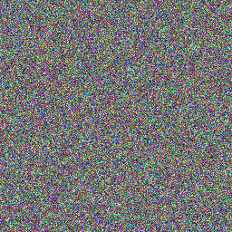

# A Matter of Perspective - EASY

## Notes
We are given a button that leads to a minimal web page that presents some data. Inspecting this data shows that the only thing that the page does is load a bitmap image. The bitmap image data changes every time the page is loaded.
An example of one of the bitmap images can be viewed below:




### Challenge
There was not much to go on, as there was not much description to the challenge, and as the image kept changing, it meant that a certain pattern would be difficult to find. A lot of time was wasted in trying to find recurring pixel values at same locations for different bitmap images, but this lead nowhere.

Another approach, which is hinted in the name, is to try and represent the data in a different way, or "from a different perspective". So... instead of trying to view an image from a 2D perspective, maybe it would make more sence trying to view it from a 3D perspective.

In order to represent the data in 3D, 3 bytes of the data are taken at a time, and represented as X-, Y- and Z- coordinates of a graph.

Doing just this in not enough however, as it can be very difficult to view the 3D graph points in a 2D space, if the density of points are too high. This is ilustrated in the graph below (generated with pyplot):


In order to get "a better perspective" of the data, a 3D heatmap graph of the data can be generated instead.
To do this, a python script was made that uses ‘numpy’, ‘scipy’ and ‘mayavi’, which is dependent on ‘PyQt5’. Mayavi is a very nice python library for creating interactive visualizations of 3D data, and can be installed with:
```shell
pip install mayavi
pip install PyQt5
```
> The other libraries can also be installed with PIP

With this, the following python3 script is made, that will make a nice (and INTERACTIVE!) graph of the data. It takes some time to generate the graph, but it is very nice when it is done, and is 'worth the wait’™!
```python
import numpy as np
from scipy import stats
from mayavi import mlab
# Info at: https://pypi.org/project/mayavi/
#   Install: pip install mayavi
#            pip install PyQt5

def read_bytes_from_file(file_path):
    with open(file_path, 'rb') as file:
        byte_data = file.read()
    return byte_data

def plot_3d_bytes(byte_data):
    x, y, z = [] ,[], []

    len_data = len(byte_data)
    for i in range(0, len_data, 3):
        if i + 2 < len_data:
            x.append(byte_data[i])
            y.append(byte_data[i+1])
            z.append(byte_data[i+2])
    print("Loaded data...")

    xyz = np.vstack([x,y,z])
    print("Normalising data, with gaussian kernel density estimation...")
    print("This may take a minute or two...")
    kde = stats.gaussian_kde(xyz)
    density = kde(xyz)

    # Plot scatter with mayavi
    print("Plotting data...")
    figure = mlab.figure('DensityPlot')
    pts = mlab.points3d(x, y, z, density, scale_mode='none', scale_factor=1)
    mlab.axes()
    print("Generating graph...")
    mlab.show()

if __name__=='__main__':
    file_path = 'bitmap_data.bmp'  # Replace with your file
    file_bytes = read_bytes_from_file(file_path)

    plot_3d_bytes(file_bytes)
```

The code generates a graph from the “bitmap” data as follows (this example is a screenshot, and therefore not interactive):


***Try it for yourself! It is very satisfying***🤓

