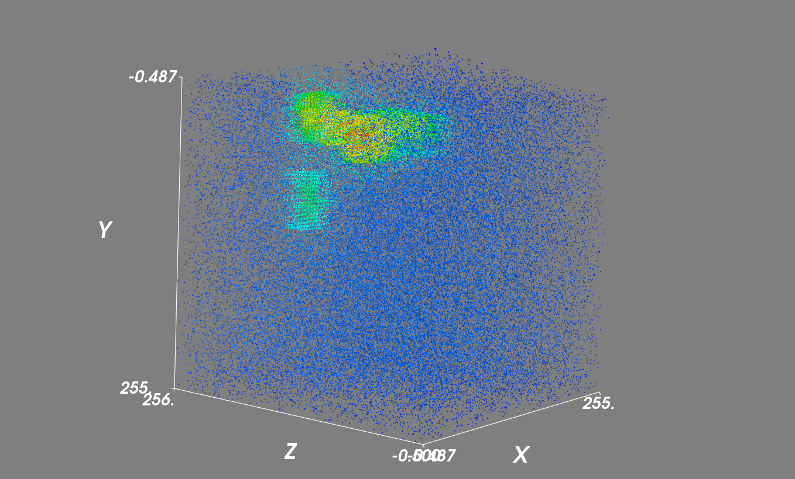
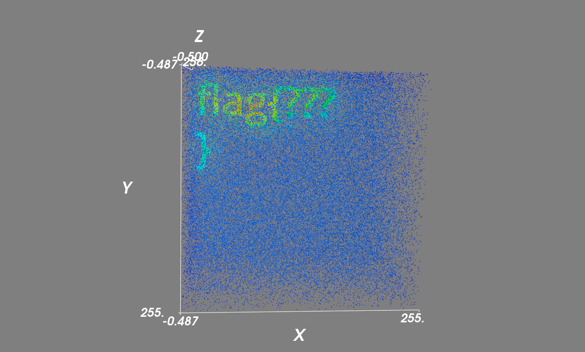

# A Matter of Perspective - Medium

## Notes
Like from the 'Easy' version of this challenge, we are again presented with "bitmap" data on a web-page. An example of the data that is given is seen below:

The same python code that was used to generate a 3D heatmap for '[A Matter of Perspective - EASY](../A-Matter-of-Perspective_Easy/README.md)' was used for this challenge, so have a look at that before viewing this.

## Challenge
By providing the new data to the python script, we can again generate a 3D heatmap graph for the data. This time however, the data points are much mores spread out on Z-axis.

This is however no issue, as we can align the data to only the X- and Y-axis, so that we can still get a clear image of the flag.

