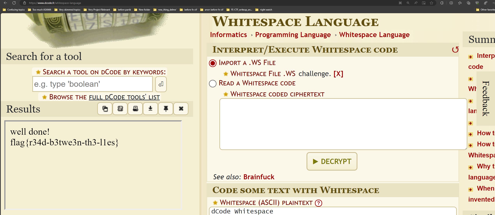

# Liminal Space

## Description
*We've intercepted this... thing. I have no idea.
I sent it to the people in the lab, and they said the file was empty, with a blank stare. Then they asked me to pay!
"Just put it on my tab", I told them. So I'm giving them a wide berth. They need their space.
We need a new line of inquiry. Maybe you can help?*

## Challenge
The challenge and it's files can be found here: https://github.com/FE-CTF/2023/tree/master/finals/challenges/liminal-spaces


## Solution
At a first glance, the file just looks like it contains nothing, but opening it with some IDEs, you can see that there are a lot of newlines, returns and spaces. This is a clear indicator of the esoteric programming language know as 'Whitespace'. (I saw a video about coding languages a while back and remember it from this. https://youtu.be/gwLQMuTspxE?t=1987)'

As this language is esoteric, there aren't very many interpreters for this language, and it cant really be compiled. I tried using different tools on github in an attempt to translate it or compile it, but nothing would work. On the other hand I could find some online interpreters that would run the code and see that I would be prompted for a password, and that got me thinking. "If it prints text, maybe there is a way to find all the characters that this program would output (by the sequence of characters representative of outputting a character), and in that, there might be the flag". 

So, with nothing to find online, I asked a friend (and teammate) for some help from his GPT4. I provided GPT4 with the whitespace file as well as a description of what it was, I also provided a link to some documentation of whitespace (https://esolangs.org/wiki/Whitespace), and told it that I wanted it output the characters that the whitespace program would print.

GPT4 answered with the following strings:
```
no memory!
abcdefghijklmnopqrstuvwxyz
abcdefghijklmnopqrstuvwxyz
: unknown format!
p'úñ}Nr

èsgF
enter password:
well done!
nope, not so much
```

This output some strings, but the flag was not in this, and by this time, the competition ended. I later looked back, and looked at what code it was generating in order to get the strings.
In this i found that in this output, there is actually a lot more characters that GPT4 did not mention in its "human readable" output.

Specifically it output the following array:
```array
['0', '0', '0', '0', '0', '0', '0', '8388608', '4194304', '2097152', '1048576', '524288', '262144', '131072', '65536', '32768', '16384', '8192', '4096', '2048', '1024', '512', '256', '128', '64', '32', '16', '8', '4', '2', '1', '110', '111', '32', '109', '101', '109', '111', '114', '121', '33', '10', '0', '0', '1', '2', '3', '4', '5', '6', '7', '8', '9', '10', '11', '12', '13', '14', '15', '16', '17', '18', '19', '20', '21', '22', '23', '24', '25', '26', '27', '28', '29', '30', '31', '32', '33', '34', '35', '36', '37', '38', '39', '40', '41', '42', '43', '44', '45', '46', '47', '48', '49', '50', '51', '52', '53', '54', '55', '56', '57', '58', '59', '60', '61', '62', '63', '64', '97', '98', '99', '100', '101', '102', '103', '104', '105', '106', '107', '108', '109', '110', '111', '112', '113', '114', '115', '116', '117', '118', '119', '120', '121', '122', '91', '92', '93', '94', '95', '96', '97', '98', '99', '100', '101', '102', '103', '104', '105', '106', '107', '108', '109', '110', '111', '112', '113', '114', '115', '116', '117', '118', '119', '120', '121', '122', '123', '124', '125', '126', '127', '16777088', '16777089', '16777090', '16777091', '16777092', '16777093', '16777094', '16777095', '16777096', '16777097', '16777098', '16777099', '16777100', '16777101', '16777102', '16777103', '16777104', '16777105', '16777106', '16777107', '16777108', '16777109', '16777110', '16777111', '16777112', '16777113', '16777114', '16777115', '16777116', '16777117', '16777118', '16777119', '16777120', '16777121', '16777122', '16777123', '16777124', '16777125', '16777126', '16777127', '16777128', '16777129', '16777130', '16777131', '16777132', '16777133', '16777134', '16777135', '16777136', '16777137', '16777138', '16777139', '16777140', '16777141', '16777142', '16777143', '16777144', '16777145', '16777146', '16777147', '16777148', '16777149', '16777150', '16777151', '16777152', '16777153', '16777154', '16777155', '16777156', '16777157', '16777158', '16777159', '16777160', '16777161', '16777162', '16777163', '16777164', '16777165', '16777166', '16777167', '16777168', '16777169', '16777170', '16777171', '16777172', '16777173', '16777174', '16777175', '16777176', '16777177', '16777178', '16777179', '16777180', '16777181', '16777182', '16777183', '16777184', '16777185', '16777186', '16777187', '16777188', '16777189', '16777190', '16777191', '16777192', '16777193', '16777194', '16777195', '16777196', '16777197', '16777198', '16777199', '16777200', '16777201', '16777202', '16777203', '16777204', '16777205', '16777206', '16777207', '16777208', '16777209', '16777210', '16777211', '16777212', '16777213', '16777214', '16777215', '32', '105', '110', '32', '0', '58', '32', '117', '110', '107', '110', '111', '119', '110', '32', '102', '111', '114', '109', '97', '116', '33', '10', '0', '1', '1', '1', '16777215', '0', '1', '112', '39', '250', '155', '225', '241', '125', '78', '142', '114', '188', '113', '138', '106', '103', '203', '179', '140', '181', '245', '124', '232', '26', '17', '115', '17', '103', '28', '70', '157', '224', '147', '194', '73', '42', '163', '16', '143', '5', '253', '15', '84', '165', '158', '248', '221', '198', '81', '132', '43', '116', '0', '108', '101', '110', '116', '101', '114', '32', '112', '97', '115', '115', '119', '111', '114', '100', '58', '32', '0', '52', '117', '110', '116', '51', '114', '50', '33', '0', '119', '101', '108', '108', '32', '100', '111', '110', '101', '33', '10', '0', '110', '111', '112', '101', '44', '32', '110', '111', '116', '32', '115', '111', '32', '109', '117', '99', '104', '10', '0', '433', '5', '3', '\x03', '\x01', '\x00', '0', '[Error: Stack Empty]']
```

(There are a few steps of me translating the array, spotting key info and getting the flag, but I'll skip this as my work flow though this was messy and random)

The interpreter that GPT4 made, and with some alterations in the end (so that it doesn't just output an array of the ASCII code values and random numbers) is:
```Python
file_path = 'challenge'

# Since Whitespace programs only use spaces, tabs, and newlines, we will read the file accordingly
with open(file_path, 'r') as file:
    ws_program = file.read()

# Function to convert Whitespace commands to a more readable format
def parse_whitespace(program):
    # Replace tabs and spaces with T and S respectively for easier reading
    readable_program = program.replace(" ", "S").replace("\t", "T").replace("\n", "L\n")
    return readable_program

# Interpreter for Whitespace Language
class WhitespaceInterpreter:
    def __init__(self, program):
        self.program = program
        self.stack = []
        self.heap = {}
        self.output = []
        self.pointer = 0
        self.labels = {}
        self.call_stack = []
        self.finished = False

    def run(self):
        # Preprocess to find labels
        self.preprocess()
        while self.pointer < len(self.program) and not self.finished:
            command = self.next_command()
            self.execute(command)

    def preprocess(self):
        """Preprocess to find labels for jumps."""
        pointer = 0
        while pointer < len(self.program):
            if self.program[pointer:pointer + 2] == "TL":
                # Label definition
                label = self.read_label(pointer + 2)
                self.labels[label] = pointer
                pointer += 2 + len(label) + 1  # Skip past the label
            else:
                pointer += 1

    def next_command(self):
        """Get the next command and move the pointer."""
        start = self.pointer
        # Find the end of the command (line break)
        end = self.program.find("\n", start) + 1
        self.pointer = end
        return self.program[start:end]

    def execute(self, command):
        """Execute a single command."""
        try:
            if command.startswith("SS"):
                # Push to stack
                number = self.read_number(command[2:])
                self.stack.append(number)
            elif command.startswith("TS"):
                # Output a character
                char = chr(self.stack.pop())
                self.output.append(char)
            elif command.startswith("TT"):
                # Output a number
                number = str(self.stack.pop())
                self.output.append(number)
            elif command.startswith("LL"):
                # End of the program
                self.finished = True
            # Add more handlers as necessary for other commands
        except IndexError:
            # Handle edge case where operation cannot be performed due to empty stack
            self.output.append("[Error: Stack Empty]")
            self.finished = True

    def read_number(self, command):
        """Read a number from the command."""
        sign = -1 if command[0] == "T" else 1
        binary = command[1:].replace("S", "0").replace("T", "1").split('L')[0]
        return sign * int(binary, 2)

    def read_label(self, start):
        """Read a label from the program."""
        end = self.program.find("\n", start)
        return self.program[start:end]

# Parsing the Whitespace program
parsed_program = parse_whitespace(ws_program)

# Executing the Whitespace program
interpreter = WhitespaceInterpreter(parsed_program)
interpreter.run()

# print(interpreter.output)

for i in interpreter.output:
    try:
        char = chr(int(i))
        if char in "\r\n\t" or i == '0':
            print(char)
        else:
            print(char, end="")
    except:
        pass
```

This code printed the following:
```


􀀀򀀀񀀀𠀀𐀀耀䀀 ကࠀЀȀĀ@no memory!


123456789:;<=>?@abcdefghijklmnopqrstuvwxyz[\]^_`abcdefghijklmnopqrstuvwxyz{|}~ in 
: unknown format!


p'úñ}Nr¼qjg˳µõ|èsgFÂI*£ýT¥ÝÆQ
                              +t
lenter password: 
4unt3r2!
well done!


nope, not so much


Ʊ
```

From this we can see that there is some text that GPT4 did not mention, specifically: **4unt3r2!**


*Me: "WTF! BRO! Y U n0 f&£%ign utuput dis u f¤$#er!"*<br>
*GPT4: ..... AI go BRRRR! .....*


What is probably happening here is that the interpreter is reading what values are loaded onto the stack, and poped, either when they are printed... or when they are used to compare two values, which would be the letters of a password.

Well, using the whitespace interpreter at 'dcode.fr' (https://www.dcode.fr/whitespace-language) and providing the 'challenge' file, we are prompted for some input, and providing this with "4unt3r2!", we get the output:
```
well done!
flag{r34d-b3twe3n-th3-l1es}
```

And there we go, we get the flag.


